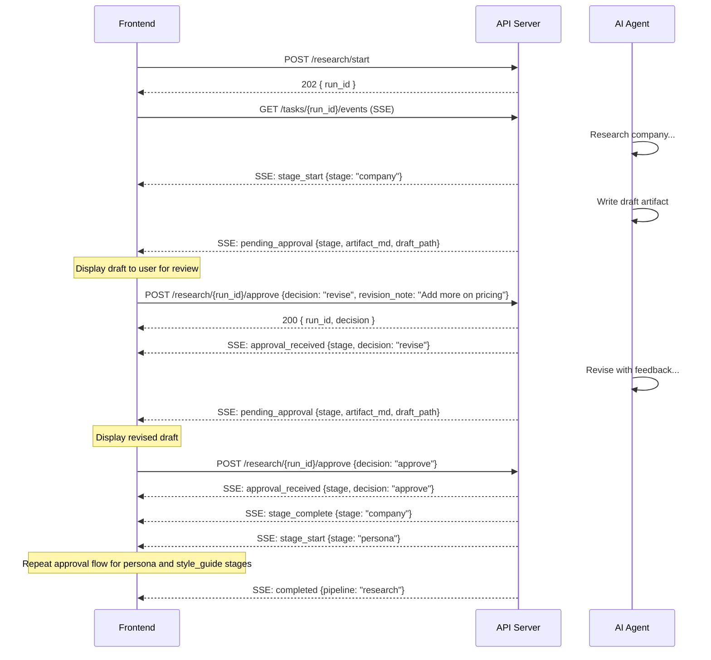
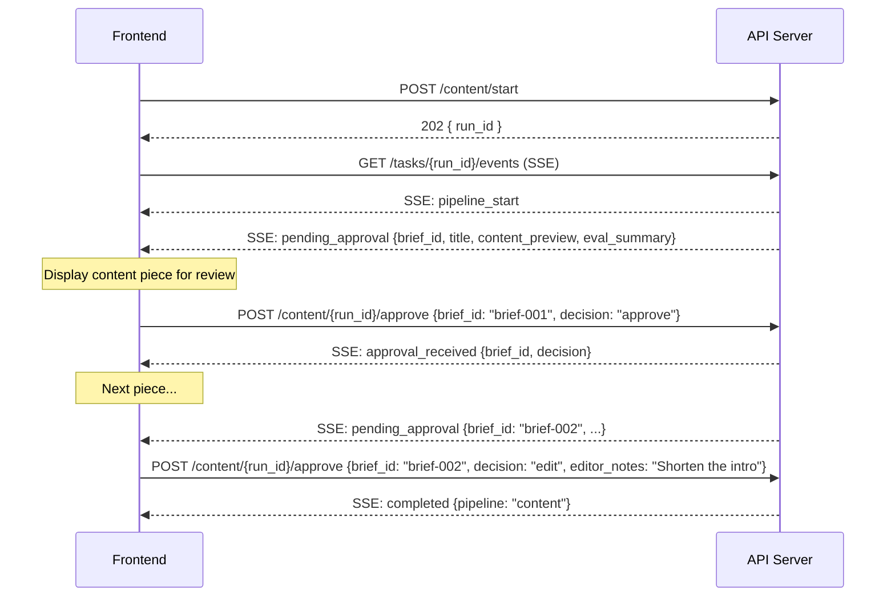

# Content Strategy Engine — API Documentation

> **For frontend engineers.** Everything you need to build the dashboard UI.
>
> **Base URL:** `http://localhost:8000`
> **API Prefix:** `/api/v1`
> **Interactive Docs:** `http://localhost:8000/docs` (Swagger) · `http://localhost:8000/redoc`

---

## 1. Quick Reference

| Method | Path | Description | Status |
|--------|------|-------------|--------|
| `GET` | `/health` | Health check | 200 |
| `GET` | `/readiness` | API key readiness check | 200 |
| `POST` | `/api/v1/gap-analysis/start` | Launch gap analysis pipeline | 202 |
| `GET` | `/api/v1/gap-analysis/{run_id}/status` | Get gap analysis status | 200 |
| `POST` | `/api/v1/research/start` | Launch research pipeline | 202 |
| `GET` | `/api/v1/research/{run_id}/status` | Get research status | 200 |
| `POST` | `/api/v1/research/{run_id}/approve` | Submit HITL approval (research) | 200 |
| `POST` | `/api/v1/content/start` | Launch content generation pipeline | 202 |
| `GET` | `/api/v1/content/{run_id}/status` | Get content generation status | 200 |
| `POST` | `/api/v1/content/{run_id}/approve` | Submit HITL approval (content) | 200 |
| `GET` | `/api/v1/tasks` | List all tasks (with filters) | 200 |
| `GET` | `/api/v1/tasks/{task_id}` | Get task detail | 200 |
| `POST` | `/api/v1/tasks/{task_id}/cancel` | Cancel a running task | 200 |
| `GET` | `/api/v1/tasks/{task_id}/events` | Stream real-time events (SSE) | 200 |
| `GET` | `/api/v1/artifacts/companies` | List all company slugs | 200 |
| `GET` | `/api/v1/artifacts/{type}/{slug}` | List artifact files | 200 |
| `GET` | `/api/v1/artifacts/{type}/{slug}/{filename}` | Get artifact file content | 200 |

---

## 2. Getting Started

### Running the Server

```bash
cd content-strategy-engine
python scripts/run_server.py
```

This starts uvicorn on `http://localhost:8000` with hot-reload. Alternatively:

```bash
uvicorn api.app:create_app --factory --host 0.0.0.0 --port 8000 --reload
```

### Environment Variables

| Variable | Default | Description |
|----------|---------|-------------|
| `API_CORS_ORIGINS` | `["http://localhost:3000", "http://localhost:3001"]` | Allowed CORS origins (JSON list) |
| `API_API_PREFIX` | `/api/v1` | URL prefix for all routes |
| `API_MAX_CONCURRENT_PIPELINES` | `3` | Max concurrent pipeline runs |

Example:
```bash
export API_CORS_ORIGINS='["http://localhost:3000", "https://app.deeppresence.com"]'
export API_MAX_CONCURRENT_PIPELINES=5
```

### Verify the Server

```bash
# Health check
curl http://localhost:8000/health
# → {"status": "ok"}

# Readiness check (verifies API keys are set)
curl http://localhost:8000/readiness
# → {"ready": true, "missing_keys": []}
```

If `ready` is `false`, the `missing_keys` array tells you which API keys need to be set (`openai_api_key`, `anthropic_api_key`, `perplexity_api_key`).

---

## 3. Core Concepts

### Pipelines

The system has 3 pipelines:

| Pipeline | What it does | Has HITL? |
|----------|-------------|-----------|
| **research** | AI agents research a company, build persona profiles, and create writing style guides | Yes — approve/revise/reject each stage |
| **gap_analysis** | Crawls company site, generates search queries, queries 4 AI platforms, analyzes citation gaps | No |
| **content** | Uses research + gap analysis outputs to auto-generate optimized content pieces | Yes — approve/edit/reject each brief |

### Async Task Model

All pipeline starts return `202 Accepted` with a `run_id`. The pipeline runs in the background. You then either:
- **Stream events** via SSE (`GET /api/v1/tasks/{run_id}/events`) — real-time updates
- **Poll status** via `GET /api/v1/{pipeline}/{run_id}/status` — simpler, request/response

### Task Lifecycle

```
                          ┌─────────────────────┐
                          │      running         │
                          └──────┬──────┬────────┘
                   HITL needed   │      │  error
                          ┌──────▼──┐  ┌▼─────────┐
                          │ pending  │  │  failed   │
                          │_approval │  └───────────┘
                          └──────┬───┘
                  approve/revise │
                          ┌──────▼──────┐
                          │   running    │◄── (may loop back to pending_approval)
                          └──────┬──────┘
                                 │ done
                          ┌──────▼──────┐
                          │  completed   │
                          └─────────────┘
```

Possible statuses: `running` · `pending_approval` · `completed` · `failed` · `cancelled` · `failed_restart`

### Slug Locks

Only one pipeline can run per company at a time. If you try to start a second gap analysis for "ramp" while one is already running, you get `409 Conflict`. The lock is released when the task completes, fails, or is cancelled.

### Concurrency Limit

A global semaphore limits total concurrent pipeline runs (default: 3). Tasks exceeding this limit queue until a slot opens.

---

## 4. Authentication & CORS

**Authentication:** None currently. The API is designed for local/internal use.

**CORS:** Configured via `API_CORS_ORIGINS` env var. Defaults to `localhost:3000` and `localhost:3001`. Set this to your frontend's origin in production.

---

## 5. Gap Analysis

### Start Gap Analysis

```
POST /api/v1/gap-analysis/start
```

**Request Body (simplified):**

The frontend only needs `company_name` and `domain`. The backend auto-resolves research artifact paths (company context, personas, style guide) from the filesystem based on the company slug.

```json
{
  "company_name": "Ramp",
  "domain": "ramp.com",
  "seed_urls": ["https://ramp.com/blog", "https://ramp.com/resources"],
  "skip_steps": [],
  "max_queries": 150,
  "platforms": ["perplexity", "openai", "gemini", "claude"],
  "language": "en",
  "region": "US",
  "max_crawl_pages": 200,
  "max_crawl_depth": 3
}
```

**Fields:**

| Field | Type | Required | Default | Description |
|-------|------|----------|---------|-------------|
| `company_name` | string | Yes | — | Company name |
| `domain` | string | Yes | — | Company domain |
| `seed_urls` | string[] | No | `[]` | URLs to crawl |
| `skip_steps` | int[] | No | `[]` | Step numbers (1-8) to skip |
| `max_queries` | int | No | `150` | Max queries (10-500) |
| `platforms` | string[] | No | `["perplexity","openai","gemini","claude"]` | AI platforms to search |
| `language` | string | No | `"en"` | Language code |
| `region` | string | No | `null` | Region filter |
| `additional_constraints` | string | No | `null` | Extra instructions for the pipeline |
| `max_crawl_pages` | int | No | `null` | Override crawl page limit |
| `max_crawl_depth` | int | No | `null` | Override crawl depth |

**`skip_steps`:** Array of step numbers (1-8) to skip. Useful for resuming a partial run. Steps: 1=embed assets, 2=generate queries, 3=search platforms, 4=enrich citations, 5=embed content, 6=analyze, 7=visualize, 8=generate report.

> **Note:** The backend automatically derives `company_slug` from `company_name`, then resolves `company_context_path`, `persona_paths`, and `style_guide_path` from the artifacts directory. Only approved (non-draft) artifacts are used. The `resolved_artifacts` field in the completion result shows which artifacts were found.

**Response (202):**

```json
{
  "run_id": "550e8400-e29b-41d4-a716-446655440000",
  "pipeline": "gap_analysis",
  "company_slug": "ramp",
  "status": "running",
  "created_at": "2026-02-16T12:34:56.789123+00:00"
}
```

### Get Gap Analysis Status

```
GET /api/v1/gap-analysis/{run_id}/status
```

**Response (200):**

```json
{
  "run_id": "550e8400-e29b-41d4-a716-446655440000",
  "pipeline": "gap_analysis",
  "company_slug": "ramp",
  "status": "completed",
  "current_step": null,
  "progress_pct": null,
  "created_at": "2026-02-16T12:34:56.789123+00:00",
  "updated_at": "2026-02-16T13:45:00.123456+00:00",
  "result": {
    "report_md": "# Gap Analysis Report: Ramp\n\n## Executive Summary...",
    "report_json": { "...": "..." },
    "visualization_paths": [
      "visualizations/gap_heatmap.html",
      "visualizations/umap.html",
      "visualizations/radar.html"
    ],
    "produced_artifacts": [
      {"type": "gap_analysis", "slug": "ramp"}
    ]
  },
  "error": null,
  "approval_payload": null
}
```

**`result` (on completion):**

| Field | Type | Description |
|-------|------|-------------|
| `report_md` | string | First 500 chars of the markdown report |
| `report_json` | object | Full structured JSON report |
| `visualization_paths` | string[] | Relative paths to HTML visualizations |
| `resolved_artifacts` | object | Research artifacts that were auto-resolved from the filesystem |
| `produced_artifacts` | array | Artifact types produced — use with `GET /artifacts/{type}/{slug}` |

**`resolved_artifacts` shape:**

```json
{
  "company_context_path": "/artifacts/company_context/ramp.md",
  "persona_paths": ["/artifacts/personas/ramp__persona-icp.md"],
  "style_guide_path": "/artifacts/style_guides/ramp.md"
}
```

Fields are `null` / `[]` if no approved artifact was found for that type. Only finalized artifacts (`.md`) are resolved; draft artifacts (`.draft.md`) are excluded.

**`error` (on failure):** String with the exception message.

---

## 6. Research Pipeline

The research pipeline runs up to 3 sequential stages: **company** → **persona** → **style guide**. Each stage can pause for human approval.

### Start Research

```
POST /api/v1/research/start
```

**Request Body (simplified):**

The frontend only needs `company_name` and `domain`. The backend constructs per-stage inputs and chains artifact paths (company_context_path, persona_paths) automatically between stages.

```json
{
  "company_name": "Stripe",
  "domain": "stripe.com",
  "seed_urls": ["https://stripe.com/blog"],
  "stages": ["company", "persona", "style_guide"],
  "auto_approve": false,
  "language": "en",
  "region": "us",
  "max_personas": 3
}
```

**Fields:**

| Field | Type | Required | Default | Description |
|-------|------|----------|---------|-------------|
| `company_name` | string | Yes | — | Company name |
| `domain` | string | Yes | — | Company domain |
| `seed_urls` | string[] | No | `[https://{domain}/]` | URLs for the research agent to study |
| `stages` | string[] | No | `["company","persona","style_guide"]` | Which stages to run (order is always company → persona → style_guide) |
| `auto_approve` | bool | No | `false` | Skip HITL gates — auto-approve all stages |
| `language` | string | No | `"en"` | Language code |
| `region` | string | No | `null` | Region context |
| `max_personas` | int | No | `3` | 1-3 (1 ICP + up to 2 secondary) |
| `internal_sources` | string[] | No | `[]` | Paths to internal transcripts/notes |
| `additional_constraints` | string | No | `null` | Extra instructions for the research agents |

> **Note:** The backend automatically derives `company_slug` from `company_name`, constructs `company_context_path` after the company stage completes, and passes `persona_paths` to the style guide stage. The frontend never needs to know about artifact paths.

**Response (202):** Same shape as gap analysis `PipelineRunResponse`.

### Get Research Status

```
GET /api/v1/research/{run_id}/status
```

**Response (200):** Same `TaskResponse` shape as gap analysis.

When `status` is `"pending_approval"`, the `approval_payload` tells you which stage needs approval:

```json
{
  "status": "pending_approval",
  "current_step": "company",
  "approval_payload": {
    "stage": "company",
    "status": "pending_approval",
    "draft_path": "/artifacts/company_context/stripe.draft.md",
    "artifact_md": "# Company Context: Stripe\n\n**Domain:** stripe.com\n\n## Origin Story\n..."
  }
}
```

The `artifact_md` field contains the full draft content to display to the user for review.

### Submit Research Approval

```
POST /api/v1/research/{run_id}/approve
```

**Request Body:**

```json
{
  "decision": "approve",
  "revision_note": null
}
```

| Field | Type | Required | Values | Description |
|-------|------|----------|--------|-------------|
| `decision` | string | Yes | `"approve"` · `"revise"` · `"reject"` | Approval decision |
| `revision_note` | string | No | — | Feedback for the agent (required if `"revise"`) |

**Response (200):**

```json
{
  "run_id": "660e8400-...",
  "decision": "approve",
  "revision_note": null
}
```

**What happens after each decision:**
- **`approve`** — Stage output is finalized, pipeline moves to the next stage (or completes)
- **`revise`** — Agent re-runs with the `revision_note` as feedback, then returns to `pending_approval` again
- **`reject`** — Pipeline stops, task status becomes `completed`

---

## 7. Content Generation

### Start Content Generation

```
POST /api/v1/content/start
```

**Request Body:**

```json
{
  "input_data": {
    "company_name": "Ramp",
    "domain": "ramp.com",
    "company_context_path": "/artifacts/company_context/ramp.md",
    "persona_paths": ["/artifacts/personas/ramp__persona-icp.md"],
    "style_guide_path": "/artifacts/style_guides/ramp.md",
    "gap_report_json_path": "/artifacts/gap_analysis/ramp/gap_report.json",
    "generation_spec_json_path": "/artifacts/gap_analysis/ramp/generation_spec.json",
    "analysis_json_path": "/artifacts/gap_analysis/ramp/analysis.json",
    "max_briefs": 10,
    "max_concurrent_workers": 3,
    "max_revision_cycles": 2,
    "auto_approve": false,
    "skip_stages": []
  }
}
```

**`input_data` fields (ContentGenerationInput):**

| Field | Type | Required | Default | Description |
|-------|------|----------|---------|-------------|
| `company_name` | string | Yes | — | Company name |
| `domain` | string | Yes | — | Company domain |
| `company_context_path` | string | No | — | Path to company context artifact |
| `persona_paths` | string[] | No | `[]` | Paths to persona artifacts |
| `style_guide_path` | string | No | — | Path to style guide artifact |
| `gap_report_json_path` | string | No | — | Path to gap report JSON |
| `generation_spec_json_path` | string | No | — | Path to generation spec JSON |
| `analysis_json_path` | string | No | — | Path to analysis JSON |
| `max_briefs` | int | No | `10` | Max content pieces to generate |
| `max_concurrent_workers` | int | No | `3` | Parallel content workers |
| `max_revision_cycles` | int | No | `2` | Max auto-revision cycles before HITL |
| `auto_approve` | bool | No | `false` | Skip HITL review gates |
| `skip_stages` | int[] | No | `[]` | Stage numbers to skip (1-4) |

**Response (202):** Same `PipelineRunResponse` shape.

### Get Content Status

```
GET /api/v1/content/{run_id}/status
```

**Response (200):** Same `TaskResponse` shape.

On completion, the `result` field contains:

```json
{
  "result": {
    "company_slug": "ramp",
    "total_briefs": 5,
    "total_approved": 4,
    "total_rejected": 1,
    "pieces": [
      { "brief_id": "brief-001", "title": "How to Automate Expense Reports", "status": "approved" },
      { "brief_id": "brief-002", "title": "Ramp vs Brex: A Complete Comparison", "status": "approved" },
      { "brief_id": "brief-003", "title": "Why Finance Teams Need Real-Time Spend Visibility", "status": "rejected" }
    ],
    "produced_artifacts": [
      { "type": "content", "slug": "ramp" }
    ]
  }
}
```

### Submit Content Approval

```
POST /api/v1/content/{run_id}/approve
```

**Request Body:**

```json
{
  "brief_id": "brief-001",
  "decision": "approve",
  "editor_notes": null
}
```

| Field | Type | Required | Values | Description |
|-------|------|----------|--------|-------------|
| `brief_id` | string | Yes | — | Which content brief to approve |
| `decision` | string | Yes | `"approve"` · `"edit"` · `"reject"` | Approval decision |
| `editor_notes` | string | No | — | Feedback for the agent (use with `"edit"`) |

**Response (200):**

```json
{
  "run_id": "770e8400-...",
  "brief_id": "brief-001",
  "decision": "approve",
  "editor_notes": null
}
```

---

## 8. Task Management

### List Tasks

```
GET /api/v1/tasks
GET /api/v1/tasks?pipeline=research
GET /api/v1/tasks?status=running
GET /api/v1/tasks?pipeline=gap_analysis&status=completed
```

**Query Parameters:**

| Param | Type | Description |
|-------|------|-------------|
| `pipeline` | string | Filter by pipeline: `research` · `gap_analysis` · `content` |
| `status` | string | Filter by status: `running` · `pending_approval` · `completed` · `failed` · `cancelled` |

**Response (200):**

```json
{
  "tasks": [
    {
      "run_id": "550e8400-...",
      "pipeline": "gap_analysis",
      "status": "completed",
      "company_slug": "ramp",
      "current_step": null,
      "created_at": "2026-02-16T12:34:56.789123+00:00",
      "updated_at": "2026-02-16T13:45:00.123456+00:00"
    },
    {
      "run_id": "660e8400-...",
      "pipeline": "research",
      "status": "pending_approval",
      "company_slug": "stripe",
      "current_step": "persona",
      "created_at": "2026-02-16T14:00:00.000000+00:00",
      "updated_at": "2026-02-16T14:05:30.000000+00:00"
    }
  ]
}
```

### Get Task Detail

```
GET /api/v1/tasks/{task_id}
```

**Response (200):** Full `TaskResponse` (same shape as pipeline-specific status endpoints).

### Cancel Task

```
POST /api/v1/tasks/{task_id}/cancel
```

Only tasks with status `running` or `pending_approval` can be cancelled.

**Response (200):**

```json
{
  "run_id": "550e8400-...",
  "status": "cancelled"
}
```

**Error (409):** Task is not in a cancellable state.

```json
{
  "detail": "Cannot cancel task in completed state"
}
```

---

## 9. Artifacts

Artifacts are the files produced by each pipeline. The API serves them directly from the filesystem.

### List Companies

```
GET /api/v1/artifacts/companies
```

**Response (200):**

```json
{
  "companies": ["carta", "ramp", "stripe"]
}
```

### List Artifact Files

```
GET /api/v1/artifacts/{artifact_type}/{slug}
```

**Valid artifact types:** `company_context` · `personas` · `style_guides` · `gap_analysis` · `content`

**Response (200):**

```json
{
  "artifact_type": "gap_analysis",
  "slug": "ramp",
  "files": [
    { "name": "gap_report.md", "size": 12345 },
    { "name": "gap_report.json", "size": 5678 },
    { "name": "generation_spec.json", "size": 3456 },
    { "name": "visualizations/gap_heatmap.html", "size": 234567 },
    { "name": "visualizations/umap.html", "size": 345678 },
    { "name": "visualizations/radar.html", "size": 123456 }
  ]
}
```

### Get Artifact Content

```
GET /api/v1/artifacts/{artifact_type}/{slug}/{filename}
```

The response content type depends on the file extension:

| Extension | Content-Type | Description |
|-----------|-------------|-------------|
| `.json` | `application/json` | Parsed JSON |
| `.html` | `text/html` | HTML (visualizations, etc.) |
| `.md`, others | `text/plain` | Plain text (markdown, etc.) |

**Examples:**

```bash
# Get markdown report
curl http://localhost:8000/api/v1/artifacts/gap_analysis/ramp/gap_report.md

# Get JSON report (returns parsed JSON)
curl http://localhost:8000/api/v1/artifacts/gap_analysis/ramp/gap_report.json

# Get HTML visualization (embed in iframe)
curl http://localhost:8000/api/v1/artifacts/gap_analysis/ramp/visualizations/gap_heatmap.html

# Get company context
curl http://localhost:8000/api/v1/artifacts/company_context/ramp/ramp.md

# Get persona
curl http://localhost:8000/api/v1/artifacts/personas/ramp/ramp__persona-icp.md
```

---

## 10. Server-Sent Events (SSE)

### Endpoint

```
GET /api/v1/tasks/{task_id}/events
```

**Headers:**
- `Accept: text/event-stream`
- `Last-Event-ID: {id}` — optional, for reconnection (replays events after this ID)

**Response Headers:**
- `Content-Type: text/event-stream`
- `Cache-Control: no-cache`
- `X-Accel-Buffering: no`

### Wire Format

Each event is SSE-formatted:

```
id: 1
event: pipeline_start
data: {"pipeline": "research"}

id: 2
event: stage_start
data: {"stage": "company"}

id: 3
event: pending_approval
data: {"stage": "company", "status": "pending_approval", "draft_path": "...", "artifact_md": "..."}

id: 4
event: approval_received
data: {"stage": "company", "decision": "approve"}

id: 5
event: stage_complete
data: {"stage": "company"}

id: 6
event: stage_start
data: {"stage": "persona"}

...

id: 10
event: completed
data: {"pipeline": "research"}

```

### Event Types

| Event | Data | When |
|-------|------|------|
| `pipeline_start` | `{ "pipeline": "research\|gap_analysis\|content" }` | Pipeline execution begins |
| `stage_start` | `{ "stage": "company\|persona\|style" }` | Research stage begins |
| `pending_approval` | `{ "stage": "...", ...interrupt_payload }` | Waiting for human decision |
| `approval_received` | `{ "stage": "...", "decision": "..." }` | Human decision submitted |
| `stage_complete` | `{ "stage": "..." }` | Research stage finished |
| `completed` | `{ "pipeline": "..." }` | Pipeline finished successfully |
| `failed` | `{ "error": "exception message" }` | Pipeline encountered an error |
| `cancelled` | `{}` | Task was cancelled |

### Terminal Events

The stream **automatically closes** after emitting one of: `completed`, `failed`, `cancelled`. You do not need to manually close the connection.

### JavaScript Integration

```typescript
function streamPipelineEvents(
  taskId: string,
  onEvent: (type: string, data: any) => void,
  onDone: () => void,
  lastEventId?: number
): EventSource {
  const url = `http://localhost:8000/api/v1/tasks/${taskId}/events`;
  const eventSource = new EventSource(url);

  // Listen for all named events
  const eventTypes = [
    'pipeline_start', 'stage_start', 'pending_approval',
    'approval_received', 'stage_complete',
    'completed', 'failed', 'cancelled'
  ];

  for (const type of eventTypes) {
    eventSource.addEventListener(type, (e: MessageEvent) => {
      const data = JSON.parse(e.data);
      onEvent(type, data);

      // Terminal events — close the connection
      if (['completed', 'failed', 'cancelled'].includes(type)) {
        eventSource.close();
        onDone();
      }
    });
  }

  eventSource.onerror = () => {
    // Browser will auto-reconnect with Last-Event-ID header
    console.warn('SSE connection error, reconnecting...');
  };

  return eventSource;
}

// Usage
const es = streamPipelineEvents(
  runId,
  (type, data) => {
    switch (type) {
      case 'pending_approval':
        showApprovalDialog(data);
        break;
      case 'completed':
        showResults(data);
        break;
      case 'failed':
        showError(data.error);
        break;
    }
  },
  () => console.log('Stream ended')
);
```

### Reconnection with Last-Event-ID

The browser's `EventSource` automatically sends `Last-Event-ID` on reconnection. The server replays all events after that ID, so you never miss events. The bounded history holds the last 100 events per task.

For manual reconnection (e.g., with `fetch`):

```typescript
async function reconnectStream(taskId: string, lastEventId: number) {
  const response = await fetch(
    `http://localhost:8000/api/v1/tasks/${taskId}/events`,
    { headers: { 'Last-Event-ID': lastEventId.toString() } }
  );
  // Parse SSE stream from response.body...
}
```

---

## 11. Human-in-the-Loop (HITL) Approval Flow

### Research Pipeline HITL

The research pipeline has up to 3 approval gates — one per stage (company, persona, style guide). Each stage follows this flow:



**Key points:**
- Each "revise" decision loops the agent back — it re-researches with your feedback, then asks for approval again
- "reject" stops the pipeline immediately
- "approve" finalizes the stage and moves to the next one
- The `approval_payload` in the status response contains the draft content (`artifact_md`) for display
- Set `auto_approve: true` in the start request to skip all approval gates

### Content Pipeline HITL

Content generation produces multiple content pieces. Each piece goes through HITL review individually:



**Content approval decisions:**
- **`approve`** — Content is finalized as-is
- **`edit`** — Agent applies your `editor_notes` feedback, then returns for approval again
- **`reject`** — Content piece is discarded

### Detecting HITL State

Two ways to detect when approval is needed:

**1. Via SSE (real-time):**
Listen for `pending_approval` events in your SSE stream.

**2. Via polling:**
Poll the status endpoint. When `status === "pending_approval"`, read `approval_payload` for the draft content:

```typescript
async function pollForApproval(runId: string, pipeline: string) {
  const response = await fetch(
    `http://localhost:8000/api/v1/${pipeline}/${runId}/status`
  );
  const task = await response.json();

  if (task.status === 'pending_approval') {
    // task.approval_payload contains draft content
    // task.current_step tells you which stage
    showApprovalUI(task.approval_payload, task.current_step);
  }
}
```

---

## 12. Integration Patterns

### Pattern 1: Launch Pipeline + Stream Progress

The most common pattern — start a pipeline and show real-time progress:

```typescript
async function launchAndStream(pipeline: 'research' | 'gap_analysis' | 'content', body: any) {
  // 1. Start the pipeline
  const startRes = await fetch(`http://localhost:8000/api/v1/${pipeline.replace('_', '-')}/start`, {
    method: 'POST',
    headers: { 'Content-Type': 'application/json' },
    body: JSON.stringify(body),
  });

  if (startRes.status === 409) {
    const err = await startRes.json();
    alert(`Conflict: ${err.detail}`);
    return;
  }

  const { run_id } = await startRes.json();

  // 2. Stream events
  const es = new EventSource(
    `http://localhost:8000/api/v1/tasks/${run_id}/events`
  );

  es.addEventListener('pipeline_start', () => setStatus('Running...'));
  es.addEventListener('stage_start', (e) => {
    const { stage } = JSON.parse(e.data);
    setStatus(`Running ${stage}...`);
  });
  es.addEventListener('pending_approval', (e) => {
    const data = JSON.parse(e.data);
    showApprovalDialog(run_id, pipeline, data);
  });
  es.addEventListener('completed', () => {
    es.close();
    setStatus('Done!');
    loadResults(run_id, pipeline);
  });
  es.addEventListener('failed', (e) => {
    es.close();
    const { error } = JSON.parse(e.data);
    setStatus(`Failed: ${error}`);
  });

  return run_id;
}
```

### Pattern 2: Poll-Based Status Checking

Simpler alternative if you don't want SSE:

```typescript
async function pollStatus(runId: string, pipeline: string, intervalMs = 3000) {
  const url = pipeline === 'gap_analysis'
    ? `http://localhost:8000/api/v1/gap-analysis/${runId}/status`
    : `http://localhost:8000/api/v1/${pipeline}/${runId}/status`;

  const poll = setInterval(async () => {
    const res = await fetch(url);
    const task = await res.json();

    updateUI(task);

    if (['completed', 'failed', 'cancelled'].includes(task.status)) {
      clearInterval(poll);
    }
  }, intervalMs);
}
```

### Pattern 3: HITL Approval Workflow

Complete approval flow with revision support:

```typescript
async function handleApproval(
  runId: string,
  pipeline: 'research' | 'content',
  approvalData: any
) {
  // Show the draft content to the user
  const userDecision = await showReviewModal({
    stage: approvalData.stage || approvalData.brief_id,
    content: approvalData.artifact_md || approvalData.content_preview,
  });
  // userDecision = { decision: 'approve' | 'revise' | 'reject', note?: string }

  const endpoint = `http://localhost:8000/api/v1/${pipeline}/${runId}/approve`;

  let body: any;
  if (pipeline === 'research') {
    body = {
      decision: userDecision.decision,
      revision_note: userDecision.note || null,
    };
  } else {
    body = {
      brief_id: approvalData.brief_id,
      decision: userDecision.decision === 'revise' ? 'edit' : userDecision.decision,
      editor_notes: userDecision.note || null,
    };
  }

  await fetch(endpoint, {
    method: 'POST',
    headers: { 'Content-Type': 'application/json' },
    body: JSON.stringify(body),
  });
}
```

### Pattern 4: Artifact Browsing

List companies, then their artifacts, then display content:

```typescript
async function browseArtifacts() {
  // 1. Get all companies
  const companiesRes = await fetch('http://localhost:8000/api/v1/artifacts/companies');
  const { companies } = await companiesRes.json();
  // companies = ["carta", "ramp", "stripe"]

  // 2. List artifact types for a company
  const types = ['company_context', 'personas', 'style_guides', 'gap_analysis', 'content'];
  for (const type of types) {
    const res = await fetch(`http://localhost:8000/api/v1/artifacts/${type}/${selectedCompany}`);
    if (res.ok) {
      const { files } = await res.json();
      renderFileList(type, files);
    }
  }

  // 3. Get file content
  const contentRes = await fetch(
    `http://localhost:8000/api/v1/artifacts/gap_analysis/ramp/gap_report.json`
  );
  const reportData = await contentRes.json();
  renderReport(reportData);

  // 4. Embed HTML visualizations in an iframe
  // <iframe src="http://localhost:8000/api/v1/artifacts/gap_analysis/ramp/visualizations/gap_heatmap.html" />
}
```

### Pattern 5: Task Dashboard

List, filter, and manage all tasks:

```typescript
async function loadDashboard() {
  // All tasks
  const allRes = await fetch('http://localhost:8000/api/v1/tasks');
  const { tasks } = await allRes.json();

  // Filter running tasks
  const runningRes = await fetch('http://localhost:8000/api/v1/tasks?status=running');
  const running = await runningRes.json();

  // Tasks needing approval
  const pendingRes = await fetch('http://localhost:8000/api/v1/tasks?status=pending_approval');
  const pending = await pendingRes.json();

  // Cancel a task
  async function cancelTask(taskId: string) {
    const res = await fetch(`http://localhost:8000/api/v1/tasks/${taskId}/cancel`, {
      method: 'POST',
    });
    if (res.status === 409) {
      const err = await res.json();
      alert(err.detail); // "Cannot cancel task in completed state"
    }
  }
}
```

---

## 13. Error Handling

### Error Response Shape

All errors return JSON with a `detail` field. Custom exception handlers also include an `error_code` field:

```json
{
  "detail": "Human-readable error message",
  "error_code": "machine_readable_code"
}
```

> **Note:** `error_code` is only present on responses from custom exception handlers (`task_not_found`, `task_conflict`, `pipeline_error`). Standard HTTP errors (400, 409 from endpoints, 422 validation) return only `detail`.

### Error Codes

| HTTP Status | Error Code | Cause | Frontend Action |
|-------------|-----------|-------|----------------|
| **400** | — | Path traversal in artifact path | Show "Invalid file path" |
| **404** | `task_not_found` | Task ID doesn't exist | Show "Task not found" |
| **404** | — | Artifact/file not found | Show "File not found" |
| **409** | `task_conflict` | Concurrent run for same company | Show "A pipeline is already running for this company" |
| **409** | — | Task not in expected state (e.g., cancel completed task, approve non-pending task) | Show the `detail` message |
| **422** | — | Invalid request body or artifact type | Show validation error from `detail` |
| **500** | `pipeline_error` | Unhandled pipeline exception | Show "Pipeline error: {detail}" |

### Common Scenarios

**Starting a pipeline when one is already running:**
```
POST /api/v1/gap-analysis/start → 409
{
  "detail": "A pipeline is already running for company 'ramp' (task_id=550e8400-...)",
  "error_code": "task_conflict"
}
```
Action: Show the existing task ID so the user can monitor or cancel it.

**Approving a task that's not pending:**
```
POST /api/v1/research/{run_id}/approve → 409
{
  "detail": "Task 550e8400-... is not pending approval (current: running)"
}
```
Action: Refresh the task status — the state may have changed.

**Task not found:**
```
GET /api/v1/tasks/{bad_id} → 404
{
  "detail": "Task not found: bad-uuid",
  "error_code": "task_not_found"
}
```

**API keys not configured:**
```
GET /readiness → 200
{
  "ready": false,
  "missing_keys": ["anthropic_api_key", "perplexity_api_key"]
}
```
Action: Show a setup banner listing missing keys.

---

## 14. Data Models Reference

### Response Models

#### PipelineRunResponse
Returned by all `POST /start` endpoints (202).

```typescript
interface PipelineRunResponse {
  run_id: string;          // UUID
  pipeline: string;        // "research" | "gap_analysis" | "content"
  company_slug: string;    // URL-safe company identifier (e.g. "ramp")
  status: string;          // "running"
  created_at: string;      // ISO 8601 datetime
}
```

#### TaskResponse
Returned by all `GET /status` and `GET /tasks/{id}` endpoints.

```typescript
interface TaskResponse {
  run_id: string;
  pipeline: string;
  company_slug: string;                  // URL-safe company identifier
  status: TaskStatus;
  current_step: string | null;           // e.g. "company", "s3_search_platforms"
  progress_pct: number | null;           // 0-100
  created_at: string;                    // ISO 8601
  updated_at: string;                    // ISO 8601
  result: Record<string, any> | null;    // Pipeline-specific result on completion
  error: string | null;                  // Error message on failure
  approval_payload: Record<string, any> | null;  // HITL context when pending
}
```

#### TaskListResponse

```typescript
interface TaskListResponse {
  tasks: TaskSummary[];
}

interface TaskSummary {
  run_id: string;
  pipeline: string;
  status: TaskStatus;
  company_slug: string;
  current_step: string | null;
  created_at: string;
  updated_at: string;
}
```

#### ApprovalResponse

```typescript
interface ApprovalResponse {
  run_id: string;
  decision: string;
  revision_note: string | null;
}
```

#### ContentApprovalResponse

```typescript
interface ContentApprovalResponse {
  run_id: string;
  brief_id: string;
  decision: string;
  editor_notes: string | null;
}
```

#### CancelResponse

```typescript
interface CancelResponse {
  run_id: string;
  status: string;  // "cancelled"
}
```

#### ErrorResponse

```typescript
interface ErrorResponse {
  detail: string;
  error_code?: string;  // "task_not_found" | "task_conflict" | "pipeline_error"
}
```

#### ProducedArtifact

Included in every pipeline's `result.produced_artifacts` array on completion. Tells the frontend which `GET /artifacts/{type}/{slug}` calls to make.

```typescript
interface ProducedArtifact {
  type: string;   // "company_context" | "personas" | "style_guides" | "gap_analysis" | "content"
  slug: string;   // Company slug (e.g. "ramp")
}
```

**Which pipeline produces what:**

| Pipeline | `produced_artifacts` |
|----------|---------------------|
| **research** | `company_context`, `personas`, `style_guides` (depends on `stages` requested) |
| **gap_analysis** | `gap_analysis` |
| **content** | `content` |

### Enums

#### TaskStatus

```typescript
type TaskStatus =
  | 'running'
  | 'pending_approval'
  | 'completed'
  | 'failed'
  | 'cancelled'
  | 'failed_restart';    // Orphan recovery — task was running when server restarted
```

### Request Models

#### GapAnalysisStartRequest (simplified)

```typescript
interface GapAnalysisStartRequest {
  company_name: string;                      // Required
  domain: string;                            // Required
  seed_urls?: string[];                      // Default: []
  skip_steps?: number[];                     // Default: []
  max_queries?: number;                      // Default: 150 (10-500)
  platforms?: string[];                      // Default: ["perplexity","openai","gemini","claude"]
  language?: string;                         // Default: "en"
  region?: string;
  additional_constraints?: string;
  max_crawl_pages?: number;
  max_crawl_depth?: number;
}
```

> The backend constructs `GapAnalysisInput` internally: derives `company_slug` from `company_name`, and auto-resolves `company_context_path`, `persona_paths`, and `style_guide_path` from the artifacts directory.

#### ResearchStartRequest (simplified)

```typescript
interface ResearchStartRequest {
  company_name: string;                      // Required
  domain: string;                            // Required
  seed_urls?: string[];                      // Default: [https://{domain}/]
  stages?: ('company' | 'persona' | 'style_guide')[];  // Default: all three
  auto_approve?: boolean;                    // Default: false
  language?: string;                         // Default: "en"
  region?: string;
  max_personas?: number;                     // Default: 3 (1-3)
  internal_sources?: string[];               // Default: []
  additional_constraints?: string;
}
```

> The backend constructs per-stage inputs (CompanyResearchInput, PersonaResearchInput, StyleGuideResearchInput) internally and chains artifact paths between stages automatically.

#### ContentStartRequest

```typescript
interface ContentStartRequest {
  input_data: ContentGenerationInput;
}
```

#### ApprovalRequest

```typescript
interface ApprovalRequest {
  decision: 'approve' | 'revise' | 'reject';
  revision_note?: string | null;
}
```

#### ContentApprovalRequest

```typescript
interface ContentApprovalRequest {
  brief_id: string;
  decision: 'approve' | 'edit' | 'reject';
  editor_notes?: string | null;
}
```

### Pipeline Input Models

#### GapAnalysisInput (internal — constructed by backend)

```typescript
// Frontend does NOT send this directly. The backend constructs it
// from the simplified GapAnalysisStartRequest fields and auto-resolved
// artifact paths from the filesystem.
interface GapAnalysisInput {
  company_name: string;
  company_slug?: string;                     // Derived from company_name
  domain?: string;
  seed_urls?: string[];                      // Default: []
  company_context_path?: string;             // Auto-resolved from artifacts/company_context/{slug}.md
  persona_paths?: string[];                  // Auto-resolved from artifacts/personas/{slug}__persona-*.md
  style_guide_path?: string;                 // Auto-resolved from artifacts/style_guides/{slug}.md
  max_queries?: number;                      // Default: 150 (10-500)
  platforms?: string[];                      // Default: ["perplexity","openai","gemini","claude"]
  language?: string;                         // Default: "en"
  region?: string;
  additional_constraints?: string;
  max_crawl_pages?: number;
  max_crawl_depth?: number;
}
```

#### CompanyResearchInput (internal — constructed by backend)

```typescript
// Frontend does NOT send this directly. The backend constructs it
// from the simplified ResearchStartRequest fields.
interface CompanyResearchInput {
  company_name: string;
  domain?: string;
  seed_urls?: string[];
  internal_sources?: string[];
  language?: string;
  region?: string;
  additional_constraints?: string;
}
```

#### PersonaResearchInput (internal — constructed by backend)

```typescript
// Backend auto-populates company_context_path from the company stage output.
interface PersonaResearchInput {
  company_name: string;
  domain?: string;
  company_slug?: string;
  company_context_path?: string;             // Auto-linked from company stage
  max_personas?: number;
  language?: string;
  region?: string;
}
```

#### StyleGuideResearchInput (internal — constructed by backend)

```typescript
// Backend auto-populates company_context_path and persona_paths from prior stages.
interface StyleGuideResearchInput {
  company_name: string;
  domain?: string;
  company_slug?: string;
  company_context_path?: string;             // Auto-linked from company stage
  persona_paths?: string[];                  // Auto-linked from persona stage
  language?: string;
  region?: string;
}
```

#### ContentGenerationInput

```typescript
interface ContentGenerationInput {
  company_name: string;                      // Required
  domain: string;                            // Required
  company_context_path?: string;
  persona_paths?: string[];                  // Default: []
  style_guide_path?: string;
  gap_report_json_path?: string;
  generation_spec_json_path?: string;
  analysis_json_path?: string;
  max_briefs?: number;                       // Default: 10
  max_concurrent_workers?: number;           // Default: 3
  max_revision_cycles?: number;              // Default: 2
  auto_approve?: boolean;                    // Default: false
  skip_stages?: number[];                    // Default: []
}
```

---

## 15. Artifact Directory Structure

```
artifacts/
├── company_context/                     ← Flat layout
│   ├── ramp.md                          ← Finalized company context
│   ├── ramp.draft.md                    ← Draft (before approval)
│   ├── carta.md
│   └── stripe.md
│
├── personas/                            ← Flat layout
│   ├── ramp__persona-icp.md             ← ICP persona
│   ├── ramp__persona-secondary-1.md     ← Secondary persona #1
│   ├── ramp__persona-secondary-2.md     ← Secondary persona #2
│   ├── carta__persona-icp.md
│   └── stripe__persona-icp.md
│
├── style_guides/                        ← Flat layout
│   ├── ramp.md
│   ├── carta.md
│   └── stripe.md
│
├── gap_analysis/                        ← Nested layout
│   └── ramp/
│       ├── company_embeddings.json      ← Embedded company content
│       ├── site_discovery/
│       │   ├── discovered_pages.json
│       │   ├── site_tree.json
│       │   └── discovery_summary.json
│       ├── queries.json                 ← Generated search queries
│       ├── platform_results/
│       │   ├── openai_results.jsonl
│       │   ├── claude_results.jsonl
│       │   ├── gemini_results.jsonl
│       │   └── perplexity_results.jsonl
│       ├── enriched_citations.json      ← Crawled + enriched cited pages
│       ├── embeddings/
│       │   ├── queries_with_embeddings.json
│       │   └── citations_with_embeddings.json
│       ├── analysis.json                ← Semantic proximity analysis
│       ├── visualizations/
│       │   ├── gap_heatmap.html         ← Embed in iframe
│       │   ├── umap.html
│       │   ├── radar.html
│       │   └── treemap.html
│       ├── gap_report.md                ← Human-readable report
│       ├── gap_report.json              ← Structured report data
│       ├── generation_spec.md           ← Content generation spec
│       └── generation_spec.json
│
├── content/                             ← Nested layout
│   └── ramp/
│       ├── briefs.json                  ← All content briefs
│       ├── run_metadata.json
│       └── content/
│           ├── brief-001/
│           │   ├── outline.json
│           │   ├── draft.md
│           │   ├── enriched.md
│           │   ├── formatted.md
│           │   ├── eval_history.json
│           │   └── final.md             ← Approved final content
│           └── brief-002/
│               └── ...
│
└── _jobs/                               ← Task persistence (internal)
    ├── 550e8400-....json
    └── 660e8400-....json
```

### Naming Conventions

| Type | Pattern | Example |
|------|---------|---------|
| Company context | `{slug}.md` | `ramp.md` |
| Company context draft | `{slug}.draft.md` | `ramp.draft.md` |
| Persona (ICP) | `{slug}__persona-icp.md` | `ramp__persona-icp.md` |
| Persona (secondary) | `{slug}__persona-secondary-{n}.md` | `ramp__persona-secondary-1.md` |
| Style guide | `{slug}.md` | `ramp.md` |
| Gap analysis | `{slug}/{file}` | `ramp/gap_report.json` |
| Content | `{slug}/content/brief-{id}/{file}` | `ramp/content/brief-001/final.md` |

### Which Pipeline Produces What

| Pipeline | Artifacts | Key Files for Display |
|----------|-----------|----------------------|
| **Research** | company_context, personas, style_guides | `{slug}.md` — rendered markdown |
| **Gap Analysis** | gap_analysis/{slug}/ | `gap_report.json` — structured data, `visualizations/*.html` — embed in iframes |
| **Content** | content/{slug}/ | `briefs.json` — brief list, `content/brief-{id}/final.md` — approved content |
